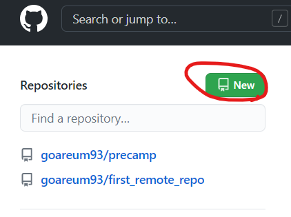
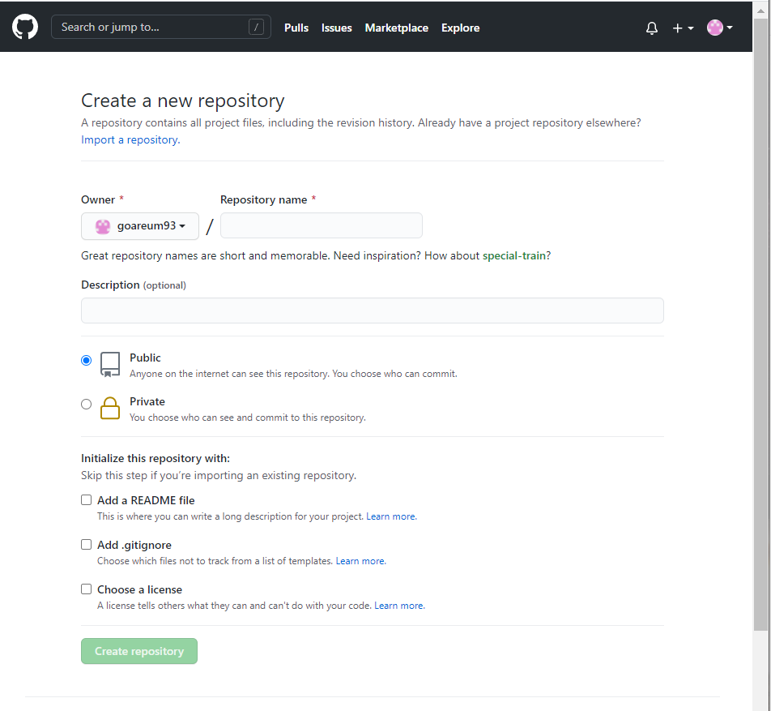

# Git 사용법

## Git 이란?

Git이란 소스코드를 효과적으로 관리하기 위해 개발된 '분산형 버전 관리 시스템'이다.


## Git 저장소 생성 및 커밋

### 저장소 만들기

```
$git init
```

- git bash에 위와 같이 작성하면 해당 디렉토리에 불투명한 `.git`폴더가 생성되고 아래와 같이 `(master)`라고 표기된다.

```
admin@DESKTOP-C5DQK3Q MINGW64 ~/git_practice (master)
```

- `$ls -a` 를 사용하면 아래와같이  `.git` 폴더가 표시된다. 

```
$ ls -a
./  ../  .git/
```


### 사용자 정보 작성

git bash를 열어 아래와 같이 사용자 정보를 작성한다. 누가 작성한지 표시를 하기 위한 것이다.

```
$git config --global user.name 'name'
$git config --global user.email 'email@gmail.com'
```

### 

### 작업 트리

git은 working directory, staging area, repositroy 세 개의 영역이 있다.

세 영역은 cf 촬영과 같이 비유할 수 있다.

- working directory = 분장실
- staging area = 스테이지 (영상찍는 곳)
- repository = 최종 cf영상 저장하는 곳


예를 들면 해당 디렉토리에 새로운 마크다운 파일을 아래와 같이 만든다.

```
touch index.md
```

`$ git status`를 통해 현재 상태를 확인하면 `index.md`가 빨간식으로 표시되어 나온다. 

비유를 하자면 해당 디렉토리는 분장실이고 배우가 분장을 완료하였다. 하지만 스테이지에는 도착하지 않은 상태이다.

```
$ git status
On branch master

No commits yet

Untracked files:
  (use "git add <file>..." to include in what will be committed)
        index.md

nothing added to commit but untracked files present (use "git add" to track)
```


### add

그렇다면 배우를 스테이지로 보내보자.

이를 위해서는 우리는 `add`를 사용해야 한다.

```
$ git add index.md
```

`$ git status`를 통해 현재 상태를 확인하면 `new file: index.md`가 초록색으로 표시되어 나온다. 

```
$ git status
On branch master

No commits yet

Changes to be committed:
  (use "git rm --cached <file>..." to unstage)
        new file:   index.md
```

add할 파일이 여러개이다 하면 아래와 같이 쓰면 된다.

```
$ git add .
```


### commit

이제 촬영된 영상을 최종적으로 보내야한다.

이릉 위해서는 commit을 사용하고 커밋 메세지를 아래와 같이  작성한다.

```
$ git commit -m 'first commit'
```

`$ git status`를 통해 현재 상태를 확인하면 아무것도 안나오고

`$ git log`를 통해 확인하면 아래와 같이 기록이 남겨있다.

```
commit 094bc64eb1f287c046e0b08814d9dfe0a9ccc9fe (HEAD -> master)
Author: areum <goareum7@gmail.com>
Date:   Thu Jun 3 14:30:52 2021 +0900

    first commit
    
```


### Summary

1. 프로젝트 폴더(디렉토리)를 만든다.
2. `.gitignore`와 `README.md`파일을 생성한다.
   1. `.gitignore`파일은 git의 파일 관리에서 무시할 내용을 담는다.
   2. `README.md`는 프로젝트의 소개 및 정리 내용을 담는다.

3. `$ git init`을 한다!
4. **주의**
   - `.git/`폴더와, `.gitignore`파일과 `README.md`가 같은 위치에 존재하는가!
5. 첫번째 커밋을 한다!


### Example

- `mkdir`을 사용하여  홈폴더에 새로운 폴더(my_plt)를 만든다.
- `cd`를 사용하여 폴더로 이동한다.
- `touch`를 사용하여 `.gitignore`와 `READ.md`를 만든다 

```
$ mkdir my_plt
$ cd my_plt/
$ touch .gitignore READ.md
```


- Pycharm을 열고 새롭게 만든 폴더를(my_plt)를 연다.

- 아래 홈페이지에서 `.gitignore`파일에 넣을 내용을 복사한다.

  - https://www.toptal.com/developers/gitignjore
  - 홈페이지에 들어가면 Windows, macOS, python, pycharm, Django 등 자신에게 맞는 운영체제, 개발환경(IDE), 프로그래밍 언어 등을 검색하고 생성버튼을 누른다.
  - 생성된 내용 전체를 복사한 뒤 pycharm으로 돌아와 `.gitignore`파일에 붙혀놓고 저장한다.

  

- terminal에서 git 저장소를 생성하고 커밋을 한다.

  - (Tip) pycharm terminal 설정(git bash 형태로 안된 경우) 방법

    - pycharm에서 Ctrl+Alt+S를 눌러 setting창에 들어간 후 왼쪽 상단 검색창에서 terminal을 검색한 후 Shell path 에서 bash.exe를 넣는다(예 : C:\Program Files\Git\bin\bash.exe)

  - `start README.md`를 쓰고 README.md 파일을 열고 작성한다.

    ```
    $ start README.md
    ```

  - `git init` 명령어를 사용하여 git 저장소 생성

    ```
    $ git init
    ```

  - `git add .`를 사용하여 stage에 추가한다

    ```
    $ git add .
    ```

  - `git status`를 사용하여 상태를 확인한다. 

    ```
    $ git status
    Changes to be committed:
      (use "git rm --cached <file>..." to unstage)
            new file:   .gitignore
            new file:   README.md
    ```


- (Tip) git bash에서 txt파일 작성하는 법

  - `touch` 명령어를 사용하여 a.txt 파일을 만든다.

  - `start`명령어를 사용하여 a.txt 파일을 연다.

  - `vim` 명령어를 사용하여 a.txt를 작성을 시작한다.

  - a.txt에 입력하기 위해서는 `i`를 누르고 편집모드(insert) 로 변경하고 내용을 작성한다.

    ```
    $ touch a.txt
    $ start a.txt
    $ vim a.txt
    ```

  - 저장하고 싶으면 `Esc`키를 눌러 명령모드(command)로 전환시켜  `:w`를 누른다. 

  - vim을 종료하고 싶으면 `:q`를 누른다.

  - 저장과 종료를 동시에 하고 싶으면 `:wq`를 누른다.


## Git Branch

### Branch 생성

- `git branch`명령어를 사용하여 새로운 branch(test) 를 만든다.

  ```
  $ git branch test
  ```

- `git branch`명령어를 사용하여 만들어진 branch(test) 확인

  ```
  $ git branch
  * master
    test
  ```


### Branch 전환

- `git switch` 명령어를 사용하여 새로만든 branch(test)로 전환한다.

  ```
  $ git switch test
  Switched to branch 'test'
  ```

- `git log` 명령어를 사용하여 이력을 확인하면  ` (HEAD -> test, master)`로 변경된 것을 확인할 수 있다.

  ```
  $ git log
  commit b42c10aa93ccaa5cae7e20dbbb345b6db5ebd457 (HEAD -> master)
  ```

- `checkout`도 같은 기능을 한다.

  ```
  $ git checkout master
  Switched to branch 'master'
  
  $ git switch test
  Switched to branch 'test'
  
  $ git log
  commit b42c10aa93ccaa5cae7e20dbbb345b6db5ebd457 (HEAD -> test, master)
  ```


### Branch 병합

- `$ git switch ` 명령어를 사용하여 `master`로 전환시킨다.

- `$ git log --oneline`을 통해 `(HEAD -> master)`가 됬는지 확인한다.

  ```
  $ git switch master
  $ git log --oneline
  b42c10a (HEAD -> master) add code to main
  ```

- `$ git merge` 명령어를 사용하여 branch를 병합시킨다.

  ```
  $ git merge test
  Updating b42c10a..2c58371
  Fast-forward
   main.py | 6 +++++-
   1 file changed, 5 insertions(+), 1 deletion(-)
  ```

  

### Branch 삭제

- `git branch -d `를 사용하여 이전 branch(test) 를 삭제한다.

  ```
  $ git branch -d test
  Deleted branch test (was 2c58371).
  ```

  


### Branch 충돌 해결

- `master`와 branch(`my-branch`)에 있는 sos.py 파이썬 파일에 서로 겹치는 부분이 있어 병합 시 충돌했을 때

  ```
  admin@DESKTOP-C5DQK3Q MINGW64 ~/my_pjt (master)
  $ git merge my-branch
  Auto-merging sos.py
  CONFLICT (content): Merge conflict in sos.py
  Automatic merge failed; fix conflicts and then commit the result.
  
  admin@DESKTOP-C5DQK3Q MINGW64 ~/my_pjt (master|MERGING)
  ```

  

- 충돌했을 때 만들었던 sos.py 파이썬 파일이 아래와 같이 변경됨

  ```python
  <<<<<<< HEAD
  print('SOS ERROR')
  
  def fire():
      print('FRIDAY')
  =======
  print('my-branch')
  
  print('developing...')
  
  
  def sos():
      print('SOS')
  >>>>>>> my-branch
  ```

- 이 상태로는 안돌아가니까 sos.py 파일 직접 변경

  ```python
  print('my-branch')
  
  print('developing...')
  
  
  def fire():
      print('FRIDAY')
  ```

- `git status`로 확인해보면 `both modified:   sos.py`라고 나옴

  ```
  $ git status
  On branch master
  You have unmerged paths.
    (fix conflicts and run "git commit")
    (use "git merge --abort" to abort the merge)
  
  Unmerged paths:
    (use "git add <file>..." to mark resolution)
          both modified:   sos.py
  
  no changes added to commit (use "git add" and/or "git commit -a")
  
  ```
  - 저장소 생성 및 커밋한 후에는 `(master)`라고 변경됨

  ```
  admin@DESKTOP-C5DQK3Q MINGW64 ~/my_pjt (master|MERGING)
  $ git add .
  
  admin@DESKTOP-C5DQK3Q MINGW64 ~/my_pjt (master|MERGING)
  $ git commit -m 'my branch'
  [master ecaa2e7] my branch
  
  admin@DESKTOP-C5DQK3Q MINGW64 ~/my_pjt (master)
  
  ```


## 원격저장소(Github)

### 원격 저장소 생성

- github 로그인 후 Repositories 에서 New 버튼을 누른다.



- 이후 repository name에 원격저장소 이름을 작성하고 공개여부를 설정 한 후(Public / Private) Create repository 클릭

  - (Tip) Add a README.File 등의 파일은 작성되어 있으면 체크할 필요 없음

  

### remote

- `git remote add`  이름 url 형태로 작성

  ```
  $ git remote add origin https://github.com/goareum93/first_remote_repo.git
  ```

- `git remote -v`로 정보 확인

  ```
  $ git remote -v
  origin  https://github.com/goareum93/first_remote_repo.git (fetch)
  origin  https://github.com/goareum93/first_remote_repo.git (push)
  ```


### push

- `push` 명령어를 통해 현재 프로젝트의 커밋된(HEAD) 내용을 원격 저장소로 내보낸다.

- `push` 저장소 `master`

  ```
  $ git push origin master
  Enumerating objects: 59, done.
  Counting objects: 100% (59/59), done.
  Delta compression using up to 8 threads
  Compressing objects: 100% (52/52), done.
  Writing objects: 100% (59/59), 120.38 KiB | 4.30 MiB/s, done.
  Total 59 (delta 18), reused 0 (delta 0), pack-reused 0
  remote: Resolving deltas: 100% (18/18), done.
  To https://github.com/goareum93/first_remote_repo.git
   * [new branch]      master -> master
  ```

  

